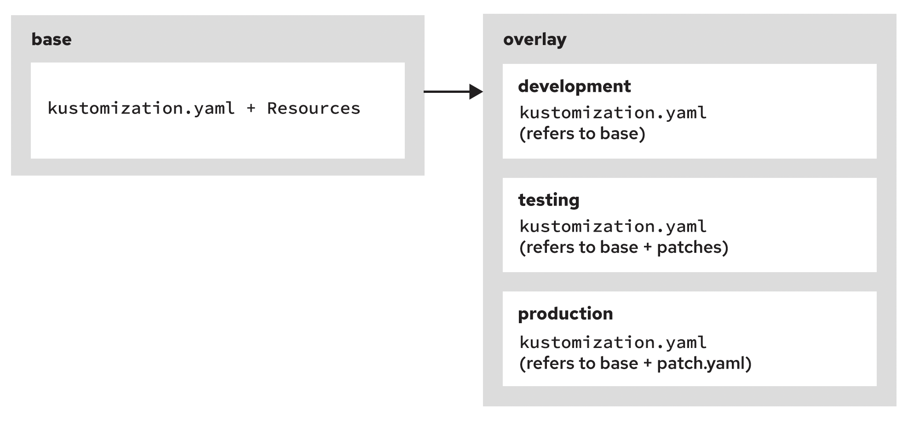

# Kustomize_Overlays Structure
```
base
├── configmap.yaml
├── deployment.yaml
├── secret.yaml
├── service.yaml
├── route.yaml
└── kustomization.yaml
overlay
└── development
    └── kustomization.yaml
└── testing
    └── kustomization.yaml
└── production
    ├── kustomization.yaml
    └── patch.yaml
```

